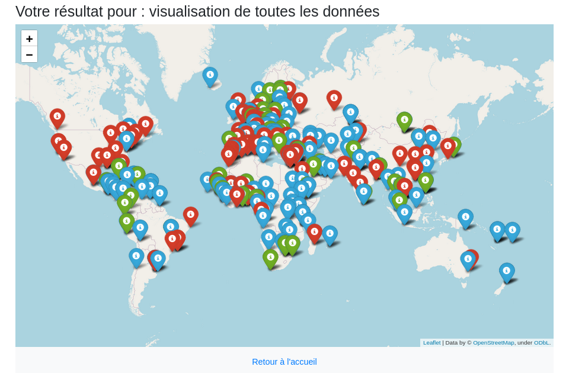
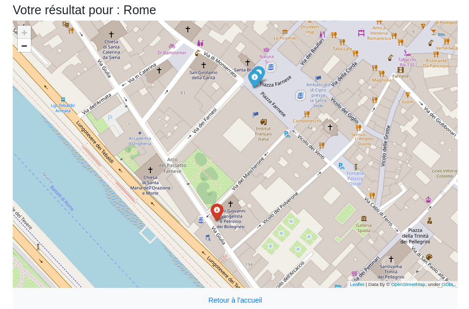

# "Réseau-diplo." : application de navigation dans les données du réseau diplomatique français

Devoir final réalisé dans le cadre du cours de Python de M. Clérice à l'Ecole nationale des chartes (année universitaire 2020-2021).

## Présentation

Cette application est destinée à la navigation dans les données du réseau diplomatique français publiées par le 
Ministère de l'Europe et des Affaires étrangères et en propose des représentations cartographiques. 

Les consignes étaient les suivantes :

- Utilisation du JSON comme "base de données".
- Utilisation d'un moteur de recherche *pure python* pour la navigation et la recherche dans les données (eg. whoosh).
- Visualisation avec du JavaScript, type *leaflet*.
- Fonctionnalité d'affichage d'un élément et un index général contenant les données.

### Nota

Les données sources sont irrégulières (informations qui ne sont pas fournies pour tous les postes, pays où le code ISO renseigné est faux, coordonnées géographiques correspondant au mauvais pays, fautes d'orthographe...).
Nous avons choisi d'adapter l'application, tant que faire se peut, à ces inconsistances plutôt que de corriger les données sources. De ce fait, il est possible
de changer les données source pour, par exemple, en utiliser une version mise à jour par le Ministère des Affaires étrangères.

## Fonctionnalités

L'application permet de rechercher dans les données par pays et par ville. 

Par pays, la recherche s'effectue via une clef de dictionnaire. Les données affichées sont une représentation HTML générée dynamiquement à partir des données correspondant à la recherche.

La recherche par ville s'effectue via un moteur de recherche plein texte *pure Python*. Une telle méthode de recherche sur les villes permet de ne pas se limiter aux capitales et d'accéder aux villes où se trouvent des représentations consulaires. 

Les résultats de recherche sont présentés sous forme de points sur une carte. Chaque point contient les données correspondant au poste diplomatique en question (nom, adresse, réseaux sociaux...)

A chaque recherche un niveau de zoom optimal est calculé, c'est-à-dire le niveau de zoom le plus bas contenant tous les points affichés. 

L'application gère également des comptes utilisateurs (inscription, connexion, mise à jour des données utilisateur, historique des recherches). 

On a aussi prévu une gestion des erreurs causées par la nature des données de départ (par exemple l'entrée dans le champ de recherche d'un pays qui n'existe plus).

## Captures d'écran

Visualisation de l'entièreté de la base de données :


*Le code couleur est utilisé pour différencier les 3 types de représentation diplomatique : 
les ambassades (bleu), les consulats (vert) et les consulats généraux (rouge)*

Visualisation de l'index général des données:


Exemple de recherche pour un pays : 


Exemple de recherche pour une ville : 



Exemple de données affichées sur un point de carte : 


## Installation et lancement

### Prérequis

Les packages suivants sont nécessaires. Lancez depuis votre terminal (Mac / Linux) la commande suivante qui vérifiera si les packages existent sur votre système et les installera sinon

```bash
sudo apt-get install python3 libfreetype6-dev python3-pip python3-virtualenv sqlite3
```

Clonez le présent *repository* dans un dossier de votre 

 ```bash
git clone https://github.com/GisliSursson/Affaires_Etrangeres_Python.git
```

Créez un environnement virtuel (dossier) dans lequel seront installées les librairies

```bash

virtualenv [chemin vers le dossier où vous voulez stocker votre environnement] -p python3
```

Activez l'environnement virtuel 

```bash
source [chemin vers le dossier de votre environnement]/bin/activate
```

Dans le dossier où vous avez cloné le projet, installez ensuite les librairies nécessaires 

```bash
pip install -r requirements.txt
```

Pour désactiver l'environnement virtuel, tapez

```bash
deactivate 
```

### Lancement

Dans le dossier contenant le projet, lancez 

```bash
python3 run.py 
```
### Mise à jour des données

Il est possible que les données sur les représentations diplomatiques soient mises à jour par le Ministère
des Affaires étrangères. Pour mettre à jour les données de l'application, il suffit de remplacer le fichier 
**`app/modeles/data.json`** par les nouvelles données et de supprimer le dossier **`index/`** (s'il existe). 
Le moteur de recherche recalculera alors l'indexation et créera un nouveau dossier contenant l'index. 

#### Tests

Si vous souhaitez mettre à jour les données, vous devez mettre à jour le fichier **`app/modeles/data.json`** dans votre 
fork, puis faire une *pull request* au *repository* principal. Ensuite, le framework [Travis CI](https://travis-ci.com/) se
chargera de vérifier la validité des nouvelles données. Travis CI est un framework d'intégration continue. Ce type de test est utilisé car la mise à jour des données 
sources peut potentiellement affecter tous les utilisateurs de l'applications.

Travis gère aussi les tests unitaires qui testent chaque bloc de l'application un par un. 


### Droits et licences

La base de données au format JSON est issue de [data.gouv.fr](https://www.data.gouv.fr/).
L'image de fond, issue du site [Pexel](https://www.pexels.com/fr-fr/), est libre de réutilisation.
La liste des codes pays à deux lettres (ISO 3166-1 alpha-2) est issue de [cette](http://documentation.abes.fr/sudoc/formats/CodesPays.htm) source. 
Le projet utilise le framework CSS/Javascript open source [Bootstrap](https://getbootstrap.com/).
L'application utilise le moteur de recherche [Whoosh](https://whoosh.readthedocs.io/en/latest/index.html)
développé par Matt Chaput. 


